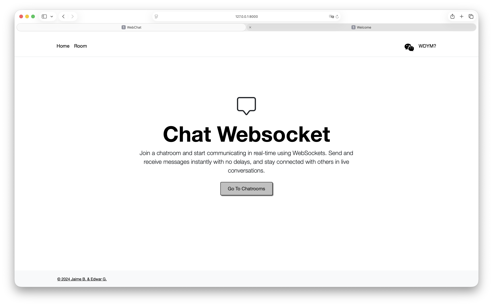
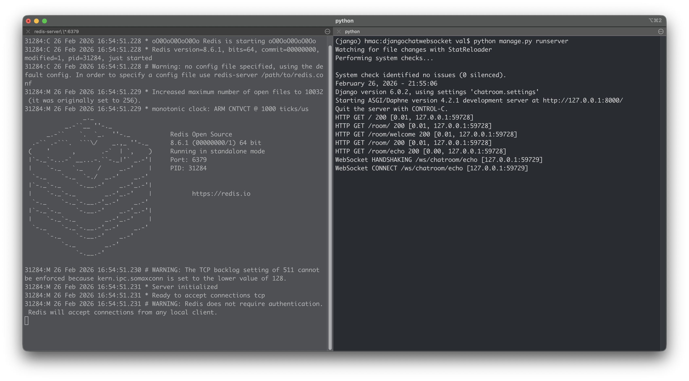
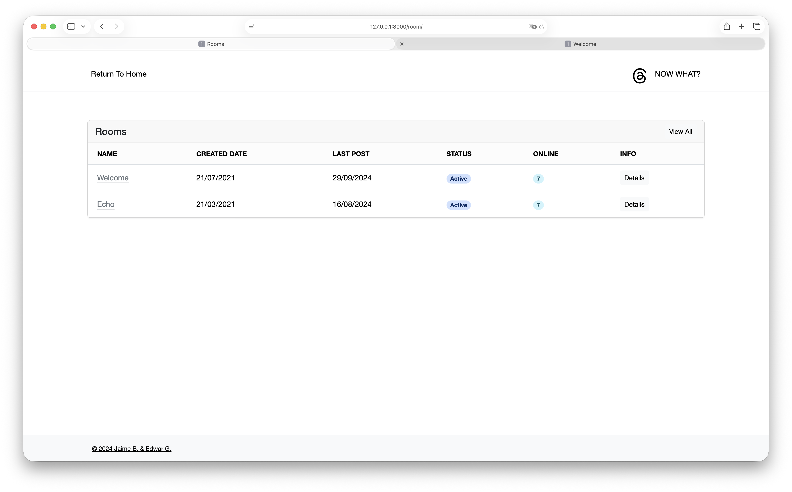
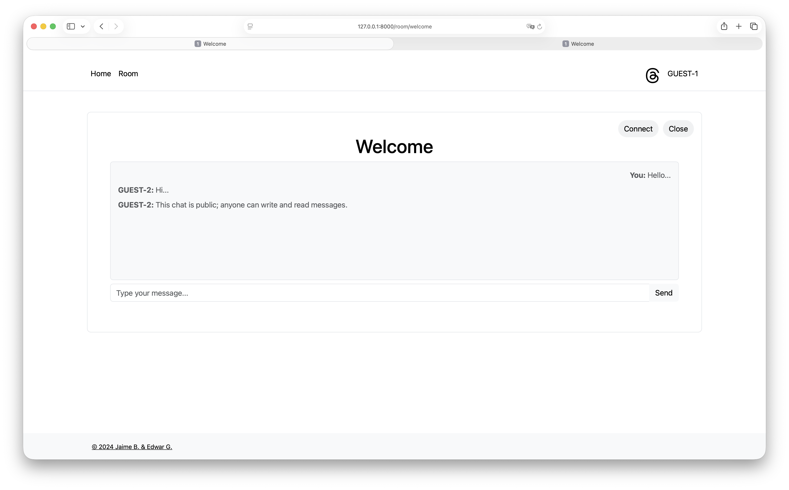

# Django WebSocket Chatroom



Real-time chatroom built with Django Channels and WebSockets. Uses Daphne as the ASGI server and Redis as the channel layer (message broker) for handling concurrent WebSocket connections. No authentication required — users join as guests.

## How It Works

Django's default request-response cycle (WSGI) is synchronous — one request in, one response out. WebSockets require persistent, bidirectional connections, which WSGI can't handle. This project uses **ASGI** (Asynchronous Server Gateway Interface) through **Daphne** to support both HTTP and WebSocket protocols simultaneously.

**Redis** acts as the channel layer, a message broker that allows different WebSocket consumers to communicate with each other. When a user sends a message, the consumer publishes it to a Redis-backed group, and Redis distributes it to all connected clients in that group.

### Consumers

- **GroupGuestConsumer** — Group chatroom where all connected users broadcast and receive messages in real time through a shared Redis channel group.
- **EchoConsumer** — Simple echo room that sends back whatever message the user sends. Useful for testing WebSocket connectivity without Redis.

### Project Structure

```
├── chatroom/              # Django project settings
│   ├── asgi.py            # ASGI config with WebSocket routing
│   ├── settings.py        # Django + Channels + Redis configuration
│   ├── urls.py            # HTTP URL routes
│   └── wsgi.py
├── chat/                  # Chat application
│   ├── consumers.py       # WebSocket consumers (GroupGuest, Echo)
│   ├── routing.py         # WebSocket URL patterns
│   ├── views.py           # HTTP views
│   ├── models.py          # Database models (User, ChatRoom, Message)
│   ├── templates/         # HTML templates
│   └── static/assets/     # CSS + Bootstrap 5.3.3
├── manage.py
└── db.sqlite3
```

> **Note:** The database models (User, ChatRoom, Message) are defined but not yet integrated with the WebSocket consumers. Messages are currently broadcast in real time without persistence.

## Requirements

- Python 3.12+
- Redis server
- pip packages: `django`, `channels`, `daphne`, `channels-redis`

## Setup

### 1. Clone the repository

```bash
git clone git@github.com:jaosber/djangochatwebsocket.git
cd djangochatwebsocket
```

### 2. Create a virtual environment

Using conda:

```bash
conda create -n chatroom python=3.12
conda activate chatroom
```

Or using venv:

```bash
python -m venv venv
source venv/bin/activate        # macOS/Linux
venv\Scripts\activate           # Windows
```

### 3. Install dependencies

```bash
pip install django channels daphne channels-redis
```

### 4. Install and start Redis

**macOS (Homebrew):**

```bash
brew install redis
redis-server
```

**Windows (WSL2):**

```bash
wsl --install -d Ubuntu
# Inside WSL:
sudo apt update
sudo apt install redis-server
sudo service redis-server start
```

**Windows (Memurai — native alternative):**

Download the developer edition from [memurai.com/get-started](https://www.memurai.com/get-started) and install it. Memurai runs as a Windows service on port 6379, fully compatible with Redis.

### 5. Run migrations and start the server

```bash
python manage.py migrate
python manage.py runserver
```

Open your browser at `http://127.0.0.1:8000`.

## Tech Stack

- **Django 5.1** — Web framework
- **Django Channels** — WebSocket support for Django
- **Daphne** — ASGI server
- **Redis** — Channel layer / message broker
- **Bootstrap 5.3.3** — Frontend styling
- **SQLite** — Database (models defined, not yet integrated)




